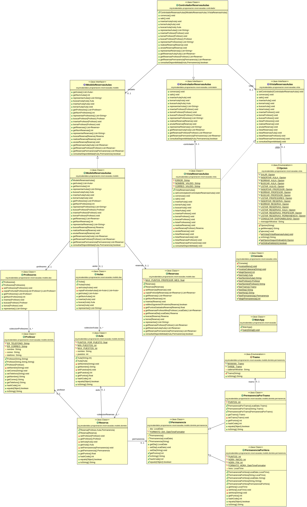

# Tarea Reservas de Aulas
## Profesor: José Ramón Jiménez Reyes
## Alumno:

El cliente nos comenta que debemos tener en cuenta los siguientes aspectos:

- Las aulas se pueden reservar para una permanencia por tramo (de mañana o de tarde) o para una permanencia por horas. La permanencia por horas se hará por horas en punto y no serán anteriores a las 8:00h ni posteriores a las 22:00h.
- Si para un día se realiza una reserva con permanencia por tramo, para ese día no se podrán hacer reservas por horas y viceversa.
- Las aulas deben tener información sobre el número de puestos de cada una.
- Las reservas no se pueden realizar para el mes en curso (sólo para el mes que viene o posteriores).
- En el centro se lleva un sistema de puntos que cada profesor gasta al hacer una reserva:
  - Una permanencia por tramo restará 10 puntos.
  - Una permanencia por hora restará 3 puntos.
  - Un aula restará 0,5 puntos por el número de puestos del aula.
  - Una reserva restará la suma del número de puntos de la permanencia más el número de puntos del aula.
  - Un profesor tiene disponibles cada mes 200 puntos por lo que si cuando va a realizar una reserva el número de puntos gastados ese mes más el número de puntos de la reserva que quiere realizar supera ese límite no dejará realizar la reserva.

Además queremos aprovechar para implementar el patrón Modelo Vista Controlador a nuestra aplicación.

El diagrama de clases que nos queda es el siguiente:

He subido a GitHub un esqueleto de proyecto gradle que ya lleva incluidos todos los test necesarios que el programa debe pasar. Dichos test están todos comentados y deberás ir descomentándolos conforme vayas avanzando con la tarea. La URL del repositorio es en la que te encuentras.

Por tanto, tu tarea va a consistir en completar los siguientes apartados:

1. Lo primero que debes hacer es realizar un fork del repositorio donde he colocado el proyecto gradle con la estructura del proyecto y todos los test necesarios.
2. Clona tu repositorio remoto recién copiado en github a un repositorio local que será donde irás realizando lo que a continuación se te pide. Añade tu nombre al fichero `README.md` en el apartado "Alumno". Haz tu primer commit.
3. Haz las modificaciones necesarias en la clase `Aula` para incluir el atributo puestos e implementar el método `getPuntos. Haz un commit.
4. Haz la clase `Permanencia` una clase abstracta y haz que el método `getPuntos` sea abstracto. Esta clase sólo tendrá como atributo el día de la permanencia. Haz un commit.
5. Crea la clase `PermanenciaPorTramo` que herede de `Permanencia`, que implemente el método `getPuntos` y que posea el atributo `tramo`. Haz un commit.
6. Crea la clase `PermanenciaPorHora` que herede de `Permanencia`, que implemento el método `getPuntos` y que posea el atributo `hora`. Esta clase debe contemplar los requisitos para las horas expuestos en el enunciado. Haz un commit.
7. Haz las modificaciones necesarias en la clase `Reserva` para que un aula se pueda reservar por un profesor para una permanencia por tramo o por horas y que implemente el método `getPuntos`. Haz un commit.
8. Haz las modificaciones necesarias en la clase dao `Reservas` para que se tengan en cuenta las restricciones comentadas en el enunciado sobre no poder reservar aulas para el mes en curso y que no se sobrepase el límite de puntos de un profesor para el mes en el que quiere realizar la reserva. Haz un commit.
9. Crea la clase `ControladorReservasAulas` que haga de puente entre el modelo y la vista. Haz un commit.
10. Crea las interfaces para el controlador, la vista y el modelo y haz que se utilicen desde la aplicación principal. Haz un commit.

###### Se valorará:
- La nomenclatura del repositorio de GitHub y del archivo entregado sigue las indicaciones de entrega.
- La indentación debe ser correcta en cada uno de los apartados.
- El nombre de las variables debe ser adecuado.
- Se debe utilizar la clase `Entrada` para realizar la entrada por teclado.
- El proyecto debe pasar todas las pruebas que van en el esqueleto del mismo y toda entrada del programa será validada para evitar que el programa termine abruptamente debido a una excepción.
- Se deben utilizar los comentarios adecuados.
- Se valorará la corrección ortográfica tanto en los comentarios como en los mensajes que se muestren al usuario.

